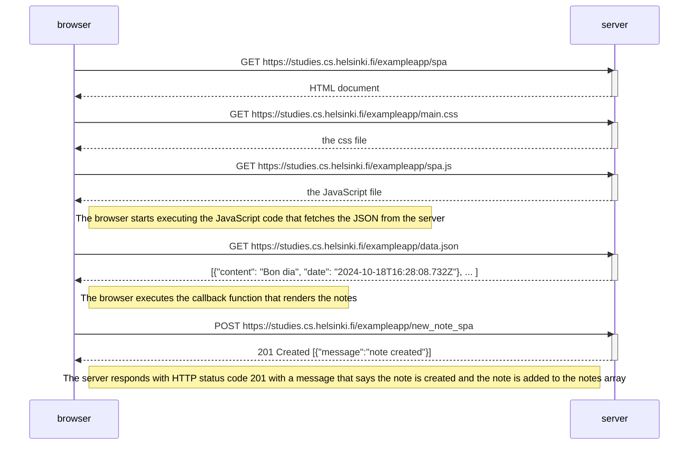

```mermaid

  sequenceDiagram
      participant browser
      participant server
  
      browser->>server: GET https://studies.cs.helsinki.fi/exampleapp/spa
      activate server
      server-->>browser: HTML document
      deactivate server
  
      browser->>server: GET https://studies.cs.helsinki.fi/exampleapp/main.css
      activate server
      server-->>browser: the css file
      deactivate server
  
      browser->>server: GET https://studies.cs.helsinki.fi/exampleapp/spa.js
      activate server
      server-->>browser: the JavaScript file
      deactivate server
  
      Note right of browser: The browser starts executing the JavaScript code that fetches the JSON from the server
  
      browser->>server: GET https://studies.cs.helsinki.fi/exampleapp/data.json
      activate server
      server-->>browser: [{"content": "Bon dia", "date": "2024-10-18T16:28:08.732Z"}, ... ]
      deactivate server
  
      Note right of browser: The browser executes the callback function that renders the notes

      browser->>server: POST https://studies.cs.helsinki.fi/exampleapp/new_note_spa
      activate server
      server-->>browser: 201 Created [{"message":"note created"}]
      deactivate server
      
      Note right of browser: The server responds with HTTP status code 201 with a message that says the note is created and the note is added to the notes array
  
      
```
